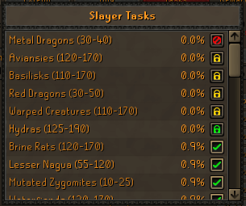
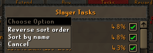

# Slayer Task Sorter
This plugin will by default sort the Slayer task lists by weighting.

Clicking / Right-clicking the "Slayer Tasks" title allows you to reverse the order or switch sort method.

